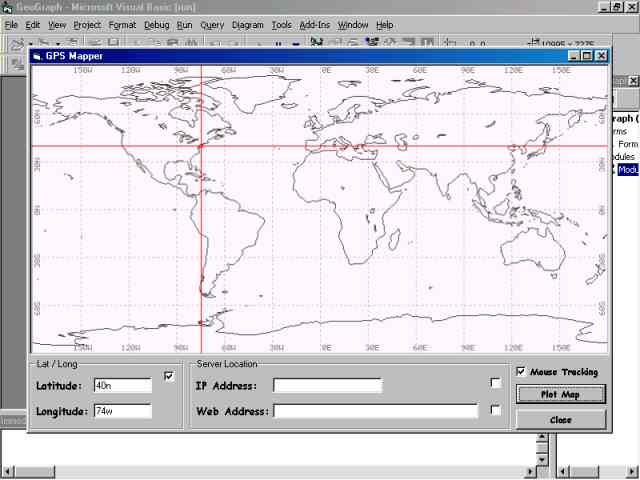



## GeoGrapher

### Description

Plot points on a world map based on latitude and lonitude in degrees. This application is still being worked on and should be finished soon. Just type in the Latitude and Longitude then click Plot Map it will display the crosshair in the correct position on the world map. I intend to use this application in an IP host Name tracer application to plot the location on a map of where the servers are located. Please vote if you like this code - oh yeah if you have any questions please email me.
 
### More Info
 

             |
---                |---
**Submitted On**   |2003-02-06 16:18:54
**By**             |[John Phillips](https://github.com/Planet-Source-Code/PSCIndex/blob/master/ByAuthor/john-phillips.md)
**Level**          |Intermediate
**User Rating**    |4.7 (89 globes from 19 users)
**Compatibility**  |VB 5\.0, VB 6\.0
**Category**       |[Miscellaneous](https://github.com/Planet-Source-Code/PSCIndex/blob/master/ByCategory/miscellaneous__1-1.md)
**World**          |[Visual Basic](https://github.com/Planet-Source-Code/PSCIndex/blob/master/ByWorld/visual-basic.md)
**Archive File**   |[GeoGrapher154032262003\.zip](https://github.com/Planet-Source-Code/john-phillips-geographer__1-42997/archive/master.zip)

